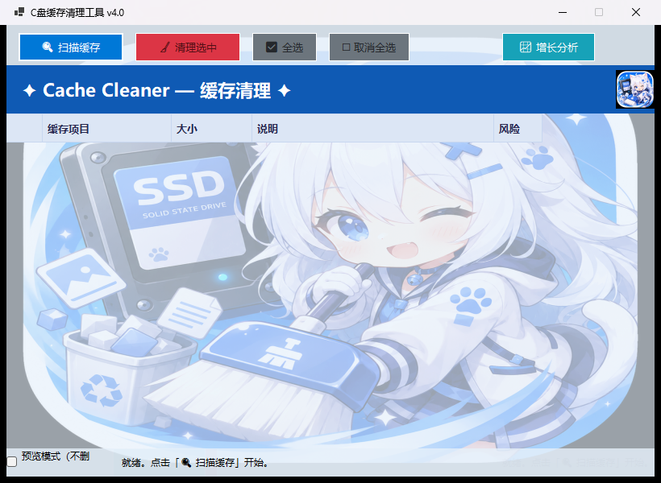
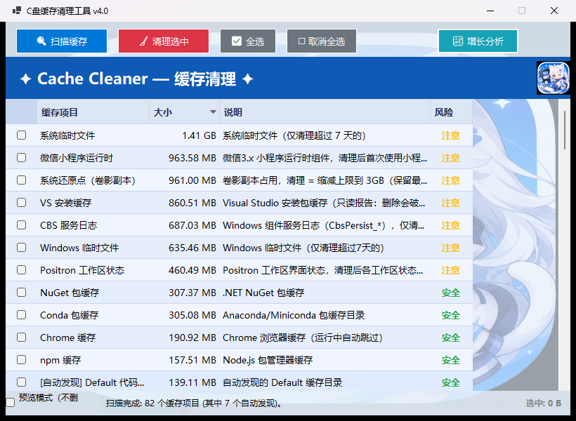

<div align="center">

# 🧹 CacheCleaner

**为 Windows 而生的轻量级磁盘瘦身工具 —— 扫描 · 清理 · 诊断 · 规则引擎，一站式**

[](https://github.com/JiangSuRan/CacheCleaner/releases)
[](https://dotnet.microsoft.com/)
[](https://github.com/JiangSuRan/CacheCleaner/releases)
[](#-许可证)

*自包含单文件 · 免安装 · 零依赖 · 数据安全优先*

</div>

---

## ✨ 一句话介绍

双击即用的系统缓存清理器：**两阶段扫描**找到缓存，**三级风险标注**守住安全线，**预览模式**先看后删，**审计日志**让每一 MB 有据可查，**JSON 规则引擎**让覆盖面无限扩展，**Agent 规则包**直面 AI 时代开发者磁盘膨胀（会话转录、模型仓库、自更新堆积）——所有这些都装在一个 118 MB 的自包含 exe 里。

## 🎯 核心能力

| 能力 | 说明 |
|---|---|
| 🔍 **两阶段智能扫描** | 秒级扫描 60+ 内置规则位置，随后自动遍历用户目录发现未知应用的缓存（支持 `.cache` / `.tmp` / `.logs` 点目录），并按「目录是否存在」自动显隐——不同机器只列出真实存在的项目 |
| 🛡️ **三级安全防护** | 安全 / 注意 / 危险三级风险标注；路径安全校验 + 系统级精确白名单；`guardProcesses` 进程守卫——浏览器、微信运行中自动跳过对应缓存项并记入日志 |
| 👁️ **预览模式** | 只统计将释放的量，不删除任何文件、不执行任何命令、不改动服务状态——先看账单，再动手 |
| 📊 **效果可观测** | 清理汇总以 **C 盘可用空间差**为准（拒绝纸面数字）；逐项释放量与失败明细（被占用/权限不足的具体路径）落盘审计日志 |
| 📈 **增长分析** | 按「最后写入时间」找出最近 3/7/14 天新写入的大文件排行，直接回答「**谁在吃我的 C 盘**」——遗留的 WPR 追踪、失控的 CBS 日志一网打尽 |
| 🧩 **JSON 规则引擎** | 64 条规则外置于 `rules.default.json`，放一份 `rules.user.json` 即可增改规则，**无需重新编译**（对标 Winapp2.ini 的规则库思路） |
| 🖥️ **系统级瘦身** | 回收站、系统还原点（缩减上限保留最新）、WinSxS 组件存储（DISM）、Windows 升级残留（cleanmgr /autoclean）、Windows 更新缓存（自动停启服务） |
| 🐳 **Docker/WSL 再生性清理** | `docker system prune` 按 df 差值计释放；vhdx 虚拟磁盘 `diskpart compact` 离线压缩——只回收空白，不碰数据 |
| 🤖 **Agent 规则包** | Claude/通义灵码/MarsCode 的会话转录超龄清理（配置与凭证绝不碰）；`pnpm store prune`、`go clean -modcache` 官方命令集成；Ollama/HuggingFace 模型库只读报告；增长分析内置迁盘顾问 |
| 🌍 **通用性** | 系统盘符运行时推导（Windows 不在 C 盘同样可用）；中英文系统输出与小数逗号 locale 兼容；Conda 安装位置动态发现 |

## 🚀 快速开始

1. 前往 [**Releases 页面**](https://github.com/JiangSuRan/CacheCleaner/releases) 下载最新版 `CacheCleaner.exe`
2. 双击运行（启动时弹出 UAC 提权确认——清理系统目录与重启删除登记需要管理员权限）
3. 点击 **「🔍 扫描缓存」**，按大小降序查看所有可清理项
4. 不放心？勾选 **「预览模式（不删除）」** 再点清理，先看将释放多少
5. 点击 **「🧹 清理选中」**——完成后弹窗展示磁盘可用空间的真实增量

> 被占用的文件会自动登记为**重启删除**，并在汇总中如实告知；被跳过的项目附失败原因。

## 📖 进阶用法

### 自定义清理规则

在 exe 同目录（便携场景）或 `%LOCALAPPDATA%\CacheCleaner\`（安装场景）放一份 `rules.user.json`，即可以声明式方式新增/覆盖规则，**无需重新编译**：

```json
[
  {
    "name": "MyApp 缓存",
    "base": "localAppData",
    "path": "MyApp\\Cache",
    "desc": "MyApp 播放缓存，清理后自动重建",
    "risk": "safe",
    "guardProcesses": ["MyApp"]
  },
  {
    "name": "某服务日志",
    "base": "windows",
    "path": "Logs\\MyService",
    "desc": "仅清理 30 天前的 *.log",
    "risk": "warn",
    "clean": "files",
    "filesPatterns": ["*.log"],
    "minAgeDays": 30,
    "recursive": true
  },
  {
    "name": "Go 模块缓存",
    "base": "userProfile",
    "path": "go\\pkg\\mod",
    "desc": "官方命令清理，按目标目录前后差值计释放",
    "risk": "safe",
    "clean": "command",
    "command": "go clean -modcache",
    "commandTimeoutMs": 600000
  }
]
```

字段速查：`base`（`localAppData` / `appData` / `userProfile` / `windows` / `programData` / `driveRoot`）· `risk`（`safe` / `warn` / `danger`）· `kind`（`path` / `file` / `special`）· `clean`（`directory` / `files` / `command` / `reportOnly`）· `filesPatterns` · `minAgeDays` · `recursive` · `skipSize` · `guardProcesses` · `command` + `commandTimeoutMs`（`clean: "command"` 时的官方清理命令与超时）。

### 增长基线监控

仓库附带只读的增长基线脚本，定期运行即可看到各关键位置的增量排行：

```powershell
powershell -NoProfile -ExecutionPolicy Bypass -File cleanup\growth-baseline.ps1
```

### 审计日志

每次扫描与清理自动记录到 `%LOCALAPPDATA%\CacheCleaner\logs\clean-日期.log`：条目大小、逐项释放量、被占用/权限不足的具体文件路径、磁盘可用空间前后差——「清理效果不理想」从此有据可查。

## 🆕 版本演进（v3.4 → v3.9）

| 版本 | 主题 | 亮点 |
|---|---|---|
| v3.4 | 修复 | 命令式清理死代码复活（还原点/内存转储首次生效）、释放量真实化、DISM 超时保护 |
| v3.5 | 覆盖面 | VSIX 扩展缓存、CBS 日志、pnpm、GPU 着色器、UWP 缓存族、Firefox/Brave/Vivaldi、AI 工具旧版本 |
| v3.6 | 可观测 | 审计日志、可用空间差口径、📈 增长分析、遗留追踪会话检测 |
| v3.7 | 通用性 | 系统盘符运行时推导、Conda 动态发现、多语言/locale 兼容 |
| v3.8 | 架构 | JSON 规则引擎 + 逐规则进程守卫 |
| v3.9 | 体验 | 预览模式、设置持久化、Docker/WSL 再生性清理 |
| v4.0 | Agent 时代 | Agent dot-home 规则包、官方 prune 命令集成、模型仓库报告、迁盘顾问 |

## 🛠️ 技术栈与构建

- C# / .NET 10 WinForms，零外部依赖，自包含单文件发布
- Inno Setup 打包安装程序（可选）

```bash
# 编译
dotnet build -c Release

# 发布自包含单文件
dotnet publish -c Release -r win-x64 --self-contained -p:PublishSingleFile=true -o publish

# 生成安装包（需 Inno Setup）
ISCC setup.iss
```

## 📁 项目结构

```
├── CacheScanner.cs      # 扫描/清理核心（规则引擎消费端、进程守卫、命令式清理框架）
├── CleaningRules.cs     # JSON 规则加载器（内嵌默认 + 侧车覆盖）
├── rules.default.json   # 内嵌声明式规则（75 条）
├── CleanLog.cs          # 清理审计日志
├── GrowthDialog.cs      # 增长分析页（含迁盘顾问）
├── AppSettings.cs       # 设置持久化
├── MainForm.cs          # 主界面
├── LICENSE              # MIT
├── cleanup/             # 增长基线监控脚本等辅助工具
└── docs/                # 设计演进记录 + Agent 时代专项调研报告
```

## 📸 截图

| 主界面 | 扫描完成（76 项 · 按大小降序 · 三级风险标注） |
|---|---|
|  |  |

## 📄 许可证

MIT
